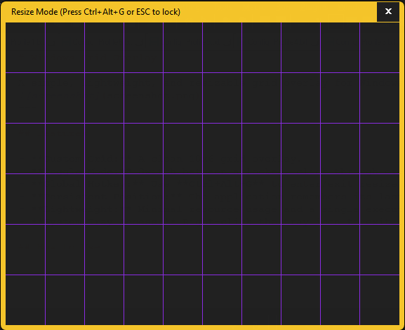
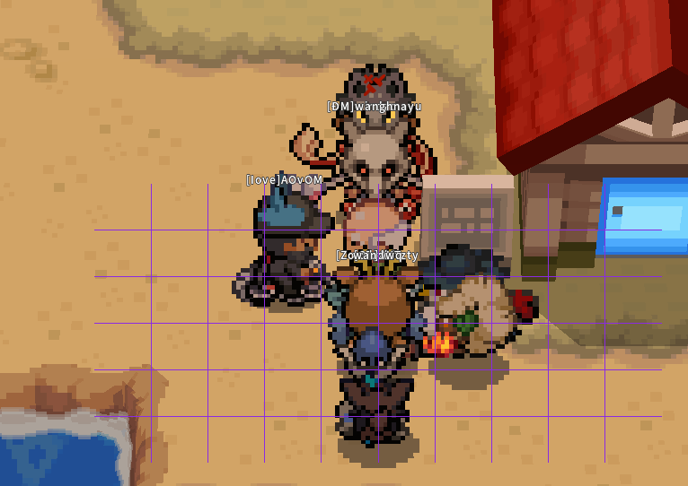
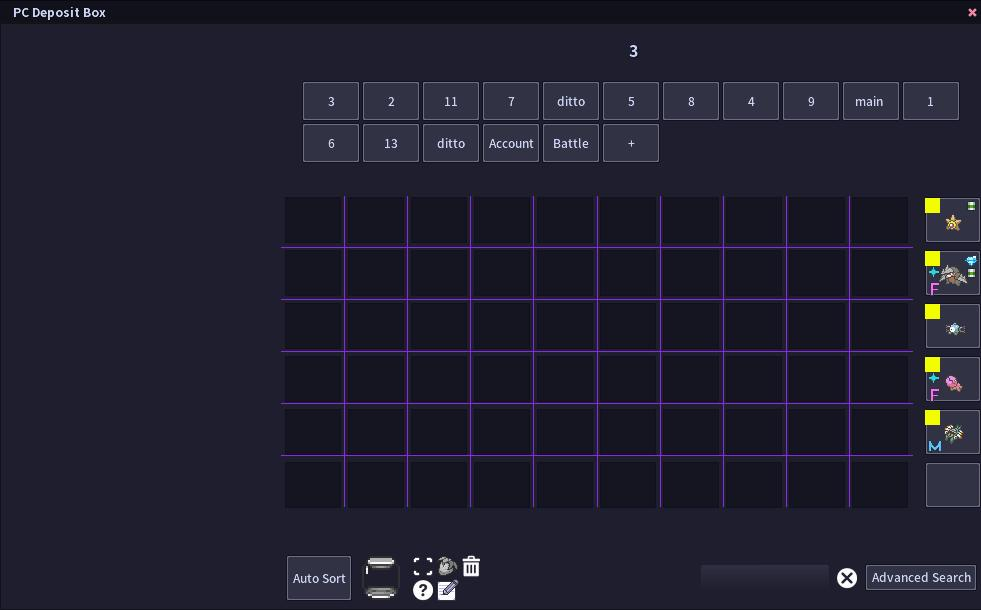

# Pokemmo Egg Grid Overlay

A lightweight, resizable grid overlay specifically designed to speed up the process of shiny hunting eggs in Pokemmo.
Stop losing track of which row you're on. Easily position your cursor to shave seconds off every cycle and save hours on your next hunt.






---

This tool overlays a simple, clean **10x6 grid** onto your screen. You can perfectly align this grid with your Pokemmo PC box. Windows only.

## Quickstart Guide

1.  Download and run `grid_overlay.exe` found in the [releases](https://github.com/sdinukad/egg-grid-overlay/releases/tag/v1.0) section.
2.  Press **Ctrl+Alt+G**. A border and title bar will appear, and the window will become solid.
3.  Go to your PC in-game. Drag and resize the grid window until it aligns perfectly with your PC boxes.
4.  Once aligned, press **Ctrl+Alt+G** or **ESC** to lock the grid. The borders will vanish, and the overlay will become click-through again.

## Features

- **Perfect Fit:** The 10x6 grid is designed to align with your PC box.
- **Toggle Resize Mode:** A global hotkey lets you adjust the grid's size and position on the fly.
- **Click-Through:** When locked, the overlay is completely invisible to your mouse, allowing you to play normally.
- **Persistent Memory:** The app saves its last position, so you only have to set it up once.
- **Lightweight:** A single, tiny executable with minimal resource usage. It just works.


## Compiling From Source

If you want to build the project yourself, you'll need the MinGW-w64 toolchain (`g++` and `windres`).

1.  **Compile the Windows resources:**
    ```bash
    windres resources.rc -o resources.o
    ```

2.  **Compile the C++ source and link everything:**
    ```bash
    g++ grid_overlay.cpp resources.o -o grid_overlay.exe -std=c++17 -static -static-libgcc -static-libstdc++ -mwindows -municode -lcomctl32 -lgdi32 -lshell32
    ```

## Credits
Got the idea from seeing it on the twitch stream of PaulusTFT - http://twitch.tv/paulustft

## Disclaimer

This is a third-party, fan-made tool and is not affiliated with the PokeMMO project or its developers. 
It is a simple screen overlay and does not interact with the game's memory, packets, or executable in any way. 
It complies with the fair play rules by acting as a simple visual aid, similar to putting a transparent sticker on your monitor.


